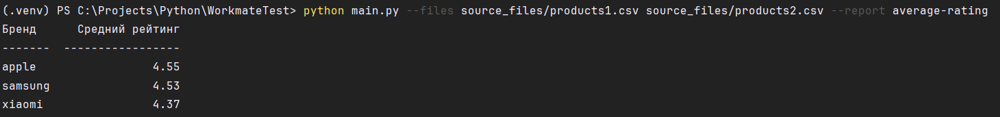
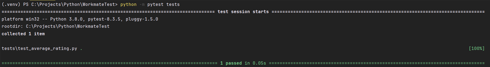

# Тестовое задание Вотинцева Н.И. для Workmate на позицию Python Junior

## Запуск проекта
Для запуска проекта нужно использовать команду 
`python main.c --files *source_file.scv* *another_source_file.scv*  --report average-rating`

Пример: 

**На данный момент можно создать только отчёт типа average-rating, однако возможность добавить другие типы отчётов остаётся открытой**

## Запуск тестов
Для запуска тестов нужно использовать команду
`python -m pytest tests`

Пример:

